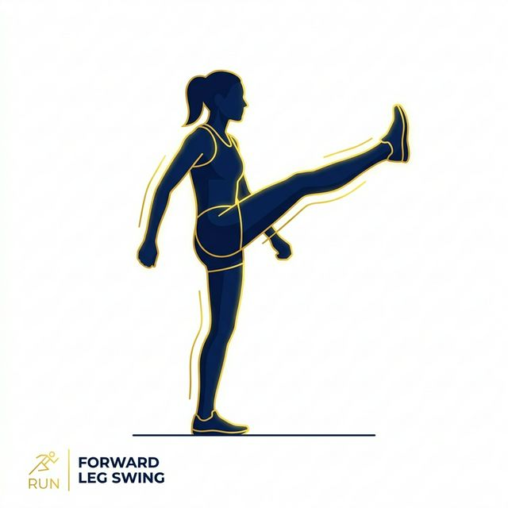
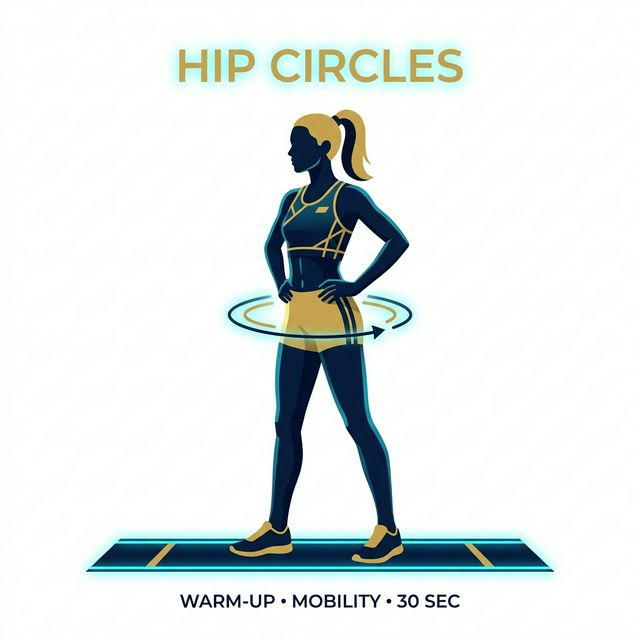
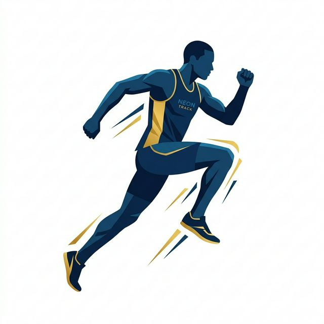
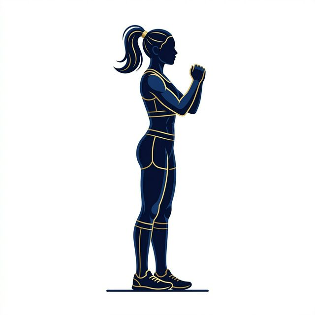
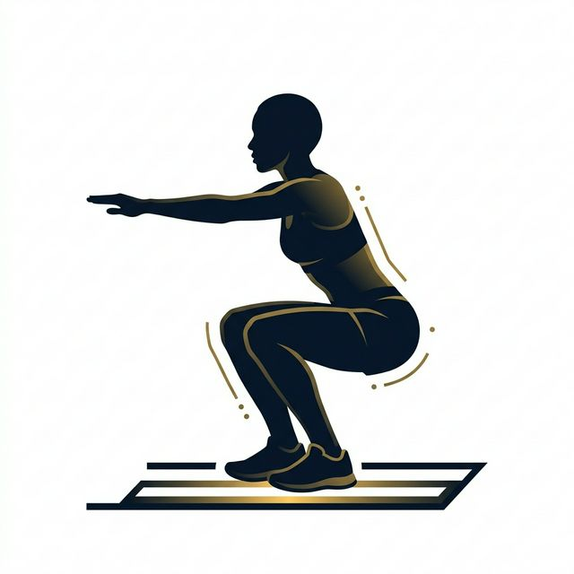

# Speed Lab Jr. - Exercise Guides
A comprehensive coaching manual for all 45 movements included in the 4-Day track and field program.

## DAY 1: Speed & Explosion

### Leg Swings (front/back)

**Instructions:** Stand next to a wall or fence for support. Keeping your torso tall and core engaged, smoothly swing the outside leg forward and backward like a pendulum. Increase the range of motion slightly with each swing.
**Focus:** Loosening the hip capsule and stretching the hamstrings/hip flexors.

### Hip Circles

**Instructions:** Stand with feet shoulder-width apart, hands on hips. Slowly rotate your hips in a large, smooth circle, pushing them front, side, back, and side. 
**Focus:** Lubricating the hip joints.

### High Knees
*(Illustration Sequence: Mid-Stride Knee Drive)*

**Instructions:** Run forward slowly while driving your knees up toward your chest as high as possible. Pump your arms aggressively in rhythm with your legs (cheek to cheek). Keep your torso tall and land lightly on the balls of your feet.
**Focus:** Ground reaction force and knee drive mechanics.

### Butt Kicks

**Instructions:** Jog forward and actively snap your heels up to strike your glutes. Keep your thighs relatively pointing straight down (do not bring the knee high).
**Focus:** Hamstring activation and fast leg cycling.

### A-Skips

**Instructions:** A rhythmic skipping drill. Drive one knee up forcefully while bouncing on the other leg. When the lead foot comes down, actively strike the ground under your center of mass. Keep your arms synchronized.
**Focus:** Forceful ground strike and posture.

### B-Skips

**Instructions:** Similar to the A-Skip, but as the knee reaches its highest point, extend the lower leg outward and aggressively claw it back down to the ground in a pawing motion.
**Focus:** Hamstring flexibility and explosive ground striking.

### Falling Starts

**Instructions:** Stand tall with feet together. Slowly lean forward like a falling tree, keeping your body in a perfectly straight line from head to heels. Right before you lose your balance, explosively push off and accelerate forward into a sprint.
**Focus:** Learning proper forward acceleration lean without bending at the waist.

### Acceleration Sprints

**Instructions:** Start from a standing or athletic two-point stance. Explode forward, focusing entirely on powerful, piston-like leg drives and huge arm swings. Gradually rise into an upright sprinting posture by the 20m mark.
**Focus:** Overcoming inertia and building top speed.

### Broad Jumps

**Instructions:** Start with feet shoulder-width apart. Swing both arms back and drop your hips into a quarter-squat. Explosively swing your arms forward and jump out as far as possible horizontally. Land softly on both feet.
**Focus:** Horizontal explosion and soft landing mechanics (deceleration).

### Pogo Hops

**Instructions:** Keep your legs almost completely stiff (slight bend in the knee) and bounce repeatedly on the balls of your feet. Think of your calves and Achilles tendons as stiff springs. Spend as little time on the ground as possible.
**Focus:** Stiff ankle reactivity and plyometric bounce.

### Standing Quad Stretch

**Instructions:** Stand tall. Bend one knee to bring your heel toward your glute, grabbing the ankle with your hand. Keep your knees together and push your hips slightly forward to deepen the stretch.
**Focus:** Lengthening the quadriceps after high-impact training.

### Hip Flexor Stretch (lunge)

**Instructions:** Drop into a half-kneeling position on the ground (one knee down). Keep your chest tall, squeeze your glutes, and gently shift your weight forward until you feel a stretch in the front of the down-leg hip.
**Focus:** Opening up tight hip flexors caused by sprinting.

### Hamstring Stretch (standing)

**Instructions:** Keeping one leg straight, place the heel of the other foot slightly in front of you with the toes pointing up. Hinge at your hips and reach down toward the toes of the extended leg while keeping your back flat.
**Focus:** Safely lengthening the hamstrings.

---

## DAY 2: Strength & Armor

### Walking Lunges
**Instructions:** Step forward into a lunge, dropping your back knee until it hovers just an inch above the ground. Your front knee should stay behind or directly over your toes. Push off the front foot to bring the back foot forward into the next step.
**Focus:** Unilateral leg strength and stability.

### Arm Circles
**Instructions:** Extend your arms straight out to your sides parallel to the ground. Make small, controlled circles forward, gradually getting larger. Repeat backwards.
**Focus:** Shoulder mobility.

### Inchworm Walk-Outs
**Instructions:** From a standing position, hinge at the hips and place your hands on the floor. Keeping your legs as straight as possible, walk your hands out until you are in a high plank position. Hold for a second, then walk your feet back toward your hands.
**Focus:** Hamstring flexibility and shoulder stability.

### Bodyweight Squats
*(Illustration Sequence: Tall Setup -> Deep Squat)*
 

**Instructions:** Stand with feet slightly wider than shoulder-width. Keeping your chest up, push your hips back and bend your knees until your thighs are parallel to the floor. Drive through your mid-foot to stand back up.
**Focus:** Quads, glutes, and basic lower body mechanics.

### Reverse Lunges
**Instructions:** Instead of stepping forward, step backward into the lunge. Keep your chest tall and slowly lower the back knee. Push off the front foot to return to the starting position.
**Focus:** Decreasing shear force on the knees while building glute strength.

### Glute Bridges
**Instructions:** Lie on your back with knees bent and feet flat on the floor close to your glutes. Squeeze your glutes tightly and drive your hips up toward the ceiling until your body forms a straight line from knees to shoulders. Pause at the top.
**Focus:** Glute activation and hip extension power.

### Single-Leg Balance
**Instructions:** Stand tall and lift one knee to 90 degrees. Hold this position perfectly still. For an advanced challenge, close your eyes.
**Focus:** Ankle and proprioceptive stability.

### Dead Bug
**Instructions:** Lie on your back with arms reaching straight up and knees bent at 90 degrees (shins parallel to the floor). Press your lower back completely flat into the ground. Slowly lower one arm and the opposite leg until they hover above the floor. Return to start and switch sides.
**Focus:** Deep core strength and preventing lower-back arch.

### Plank Hold
**Instructions:** Support your bodyweight on your forearms and toes. Keep your elbows directly under your shoulders. Squeeze your core, glutes, and quads to maintain a perfectly straight, rigid line from your head to your heels. Do not let your hips sag!
**Focus:** Anti-extension core endurance.

### Side Plank
**Instructions:** Lie on your side, supporting your weight on one forearm and the side of your foot. Stack your feet. Lift your hips until your body forms a straight line.
**Focus:** Oblique and lateral core strength.

### Child's Pose
**Instructions:** Start on all fours, then sit your hips back onto your heels. Walk your hands forward on the floor as far as possible, dropping your chest toward the ground.
**Focus:** Relaxing the lower back and lats.

### Pigeon Pose
**Instructions:** From a plank position, bring your right knee forward and place it behind your right wrist, laying your shin across the mat. Extend the left leg straight back. Sink your hips down toward the floor.
**Focus:** Deep stretching of the glute rotators and piriformis.

### Cat-Cow Stretch
**Instructions:** On hands and knees, slowly inhale and drop your belly toward the floor, lifting your chest and tailbone (Cow). Then exhale, round your back toward the ceiling, and tuck your chin (Cat).
**Focus:** Spinal mobility and relieving tension.

---

## DAY 3: Speed Endurance

### Easy Jog
**Instructions:** A very relaxed, slow-paced run. You should easily be able to hold a conversation.
**Focus:** Raising body temperature and loosening muscles.

### Carioca (grapevine)
**Instructions:** Moving laterally, cross your trailing leg in front of your lead leg, step out with your lead leg, then cross your trailing leg behind. Rotate your hips fluidly while keeping your shoulders square to the direction you are facing.
**Focus:** Lateral mobility and hip rotation.

### Flying 20s
**Instructions:** Set up three cones spanning 40m total (Start, 20m mark, 40m mark). Build up to top speed from the start to the middle cone, then try to completely maintain your absolute max speed through the 40m finish line. Walk back completely before repeating.
**Focus:** Top-end maximum velocity maintenance.

### 60m Repeats
**Instructions:** Run 60 meters at approximately 80-85% of your max effort. Focus entirely on smooth, flawless running form rather than straining. Walk back completely to recover.
**Focus:** Speed endurance and running economy under slight fatigue.

### Stride-Outs
**Instructions:** A relaxed run over 80m. Start slow, smoothly accelerate up to about 75% speed by the middle, and slowly decelerate. Think of this as "floating" down the track.
**Focus:** Flushing the legs and maintaining rhythm.

### Bounding
**Instructions:** Run forward with drastically exaggerated, bounding leaps. Drive your knee up and hang in the air as long as possible before striking the ground and launching into the next bound.
**Focus:** Horizontal plyometric power and stride length.

### Lateral Hops over line
**Instructions:** Find a line on the track or gym floor. Keeping your feet tightly together, hop side-to-side over the line as fast as possible.
**Focus:** Fast-twitch muscle recruitment and lateral ankle strength.

### Easy Walk
**Instructions:** Walk completely relaxed.
**Focus:** Bringing the heart rate down.

### Seated Hamstring Stretch
**Instructions:** Sit on the ground with both legs extended. Keeping your back somewhat flat, reach forward toward your toes.
**Focus:** Central hamstring stretch.

### Standing Calf Stretch
**Instructions:** Face a wall. Place one foot forward (bent knee) and one foot straight back, pushing the heel of the back foot firmly into the ground. Lean into the wall until you feel the calf stretch.
**Focus:** Relieving tight calf muscles and Achilles tendons.

---

## DAY 4: Recovery & Movement

### Easy Jog or Brisk Walk
**Instructions:** Keep the pace extremely relaxed. This is purely to get the blood flowing.
**Focus:** Active recovery.

### World's Greatest Stretch
**Instructions:** Step into a deep forward lunge. Place both hands on the ground inside your front foot. Take the arm closest to your front leg, drop the elbow toward the floor, and then rotate your torso to reach that hand straight up toward the ceiling. Return to start and switch.
**Focus:** Incredible full-body mobility (hips, thoracic spine, ankles).

### 90/90 Hip Stretch
**Instructions:** Sit on the floor. Bend your front leg to a 90-degree angle and lay it flat in front of you. Take your back leg and bend it to a 90-degree angle behind you. Keep your torso tall and gently lean forward over the front knee.
**Focus:** Internal and external hip rotation.

### Hip Flexor Lunge + Reach
**Instructions:** From a half-kneeling lunge, gently push your hips forward. Raise the arm on the same side as your trailing leg straight up to the ceiling, then lean slightly sideways over the front leg.
**Focus:** Deep hip flexor and psoas stretching.

### Thread the Needle
**Instructions:** Start on all fours. Slide your right arm underneath your left arm, dropping your right shoulder and ear to the floor. Hold to stretch the upper back.
**Focus:** Thoracic (mid-back) mobility and shoulder stretch.

### Ankle Circles
**Instructions:** Sit or stand, lift one foot off the ground, and draw large, extremely slow circles with your toes. Go 10 times clockwise, then 10 times counter-clockwise.
**Focus:** Ankle mobility, preventing shin splints.

### Single-Leg RDL (bodyweight)
**Instructions:** Stand on one leg with a slight bend in the knee. Hinge at your hips, extending your free leg straight back behind you, while dropping your chest toward the floor. Your body should form a straight line from your head to your back heel. Use your hamstrings and glute to stand back up.
**Focus:** Balance, hamstring length, and glute strength.

### Heel-to-Toe Walk (tightrope)
**Instructions:** Walk forward in a perfectly straight line, placing the heel of your front foot directly against the toes of your back foot on every single step. Use your arms for balance.
**Focus:** Fine motor control and stability.
